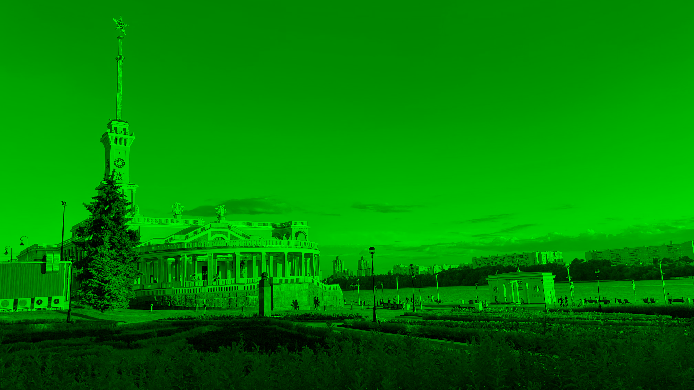
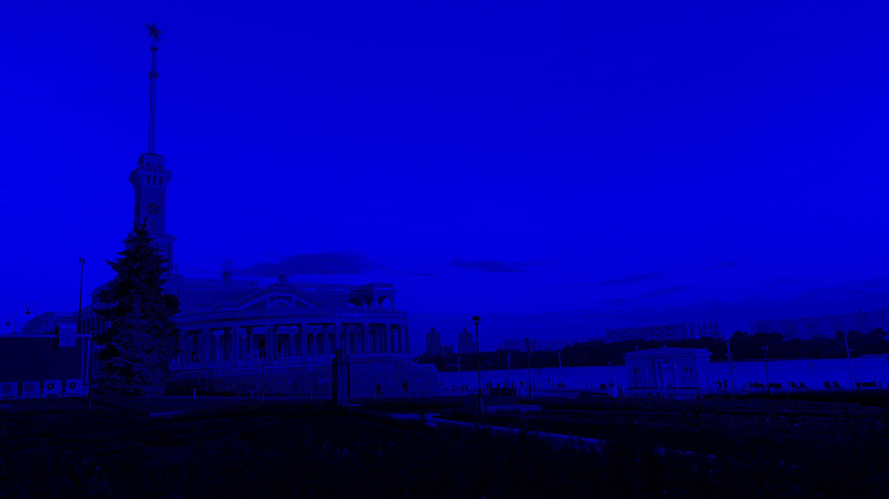
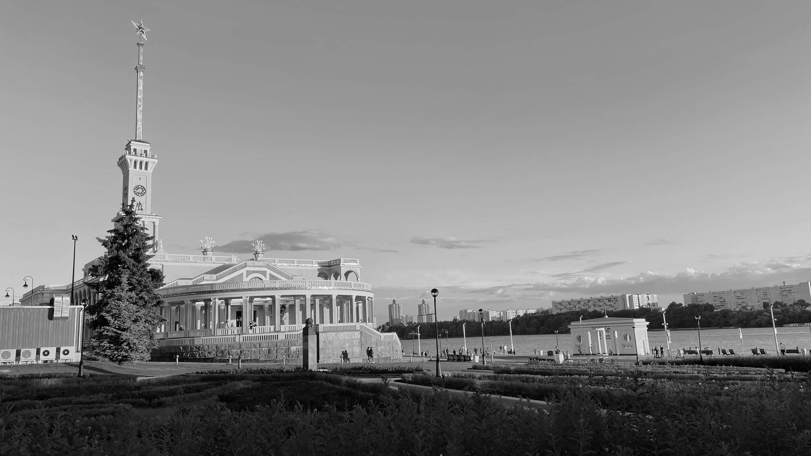
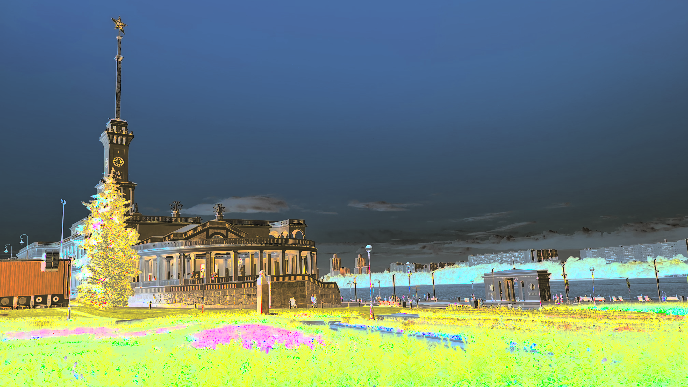
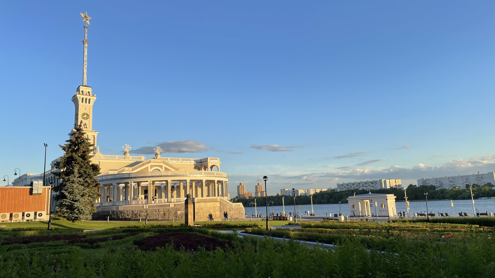

# Лабораторная работа №1

## Цветовые модели и передискретизация изображений

Исходное изображение: `port.png`.

Параметры передискретизации:

- `M = 3` - коэффициент растяжения;
- `N = 4` - коэффициент сжатия;
- `K = M / N = 3 / 4` - общий коэффициент передискретизации.

Для чтения, записи изображений и операций изменения размера используется библиотека Pillow.

## Исходное изображение

Размер исходного изображения: `4032 x 2268`.


## 1. Цветовые модели

### 1.1. Выделение компоненты R

В данном изображении сохранена только красная компонента. Зеленая и синяя компоненты обнулены.


### 1.2. Выделение компоненты G

В данном изображении сохранена только зеленая компонента. Красная и синяя компоненты обнулены.



### 1.3. Выделение компоненты B

В данном изображении сохранена только синяя компонента. Красная и зеленая компоненты обнулены.



### 1.4. Переход к HSI и выделение яркостной компоненты

Для каждого пикселя яркостная компонента вычислялась как среднее значение нормированных компонент RGB:

```text
I = (R + G + B) / 3
```

Результат сохранен как полутоновое изображение.



### 1.5. Инвертирование яркостной компоненты

После перехода к HSI яркостная компонента была заменена на обратную. Затем изображение было переведено обратно в RGB.



## 2. Передискретизация

### 2.1. Растяжение изображения в M раз

Коэффициент растяжения: `M = 3`.

Размер результата: `12096 x 6804`.


### 2.2. Сжатие изображения в N раз

Коэффициент сжатия: `N = 4`.

Размер результата: `1008 x 567`.


### 2.3. Передискретизация в K раз в два прохода

Передискретизация выполнена последовательно и итоговый коэффициент:

```text
K = M / N = 3 / 4
```

Размер результата: `3024 x 1701`.


### 2.4. Передискретизация в K раз за один проход

Изображение сразу приведено к размеру, соответствующему коэффициенту `K = 3 / 4`.

Размер результата: `3024 x 1701`.



## Вывод

В ходе работы были получены отдельные цветовые компоненты RGB, выполнено преобразование изображения к модели HSI, сохранена яркостная компонента и построено изображение с инвертированной яркостью. Также выполнены растяжение, сжатие и два варианта передискретизации изображения с коэффициентом `K = M / N = 3 / 4`.
