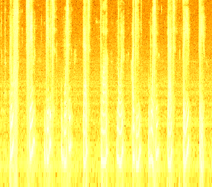

# Лабораторная работа №10. Обработка голоса

## Вариант 3. Анализатор речи

Исходные записи:

- `0.wav` ... `9.wav` - образцы произнесения цифр;
- `+.wav` - образец слова "плюс";
- `number.wav` - запись телефонного номера.

Контрольная строка для подсчета ошибок: `+79852018533`

## Алгоритм

1. Все WAV-файлы читаются как одноканальные 16-битные PCM-записи.
2. Для `number.wav` строится спектрограмма с окном Ханна. Частоты отображаются по логарифмической шкале от 80 до 6000 Гц.
3. Запись номера сегментируется по RMS-энергии:
   - окно `20 мс`, шаг `10 мс`;
   - порог активности `0.08` от максимального RMS;
   - соседние активные участки с паузой меньше `180 мс` объединяются;
   - к границам добавляется запас `50 мс`.
4. Для каждого образца и каждого сегмента вычисляется спектральный признак:
   - запись понижается до `8000 Гц`;
   - используется FFT по окнам `256` отсчетов с шагом `80` отсчетов;
   - спектр группируется по полосам частот и логарифмируется;
   - вектор каждого кадра нормируется.
5. Сегмент сопоставляется со всеми образцами методом DTW. Побеждает символ с минимальным расстоянием.
6. Достоверность сегмента считается как относительный отрыв лучшего результата от второго:

```
confidence = (second_score - best_score) / second_score
```

Итоговая достоверность - среднее значение по всем сегментам.

## Результаты

Распознанная цепочка: `+73802008033`

Число ошибок относительно контрольной строки: `4`.

Средняя оценка достоверности: `0.247`.

| № | Время, с | Символ | Достоверность |
| ---: | --- | :---: | ---: |
| 1 | 0.660-1.380 | `+` | 0.088 |
| 2 | 1.920-2.610 | `7` | 0.262 |
| 3 | 3.190-3.940 | `3` | 0.037 |
| 4 | 4.430-5.270 | `8` | 0.272 |
| 5 | 6.030-6.430 | `0` | 0.126 |
| 6 | 7.320-7.910 | `2` | 0.233 |
| 7 | 8.470-9.050 | `0` | 0.409 |
| 8 | 9.600-10.310 | `0` | 0.090 |
| 9 | 10.780-11.620 | `8` | 0.296 |
| 10 | 12.180-12.600 | `0` | 0.054 |
| 11 | 13.320-13.850 | `3` | 0.574 |
| 12 | 14.570-14.890 | `3` | 0.524 |

## Спектрограмма

Спектрограмма записи `number.wav`, построенная оконным преобразованием Фурье с окном Ханна и логарифмической шкалой частот:



## Вывод

Процедура сегментации выделила `12` слов из записи телефонного номера. Сопоставление сегментов с алфавитом из `11` образцов выполнено по спектральным признакам с динамическим выравниванием времени. Номер распознан как `+73802008033`; относительно контрольной строки `+79852018533` получено `4` ошибки.
