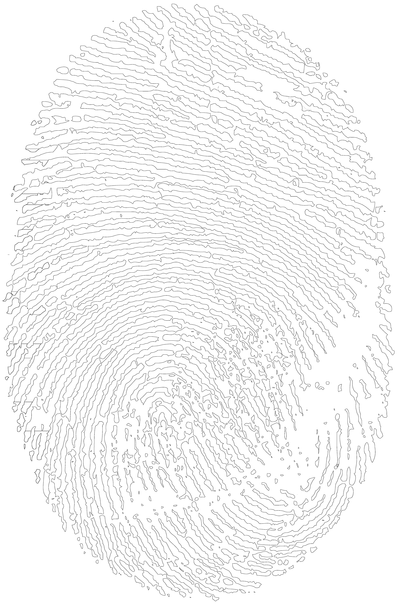
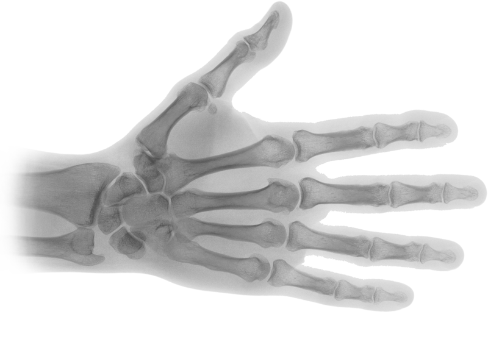
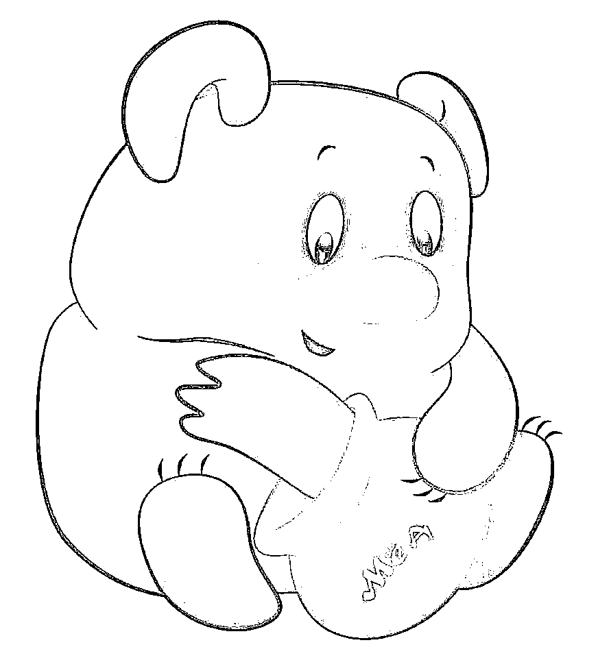
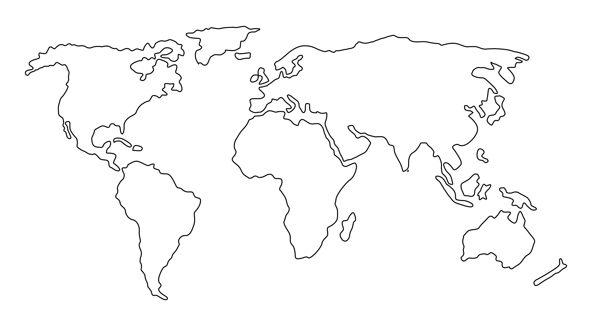

# Лабораторная работа №2

## Обесцвечивание и бинаризация растровых изображений

Вариант: `16`. Метод бинаризации: адаптивная бинаризация Брэдли и Рота, окно `5 x 5`.

## Результаты

### Изображение 1

Размер: `4597 x 7000`. Окно бинаризации: `5 x 5`, коэффициент `t = 0.15`.

| Исходное изображение | Полутоновое изображение | Бинаризация Брэдли и Рота |
| --- | --- | --- |
|  |  |  |

### Изображение 2

Размер: `800 x 584`. Окно бинаризации: `5 x 5`, коэффициент `t = 0.15`.

| Исходное изображение | Полутоновое изображение | Бинаризация Брэдли и Рота |
| --- | --- | --- |
|  |  |  |

### Изображение 3

Размер: `872 x 963`. Окно бинаризации: `5 x 5`, коэффициент `t = 0.15`.

| Исходное изображение | Полутоновое изображение | Бинаризация Брэдли и Рота |
| --- | --- | --- |
|  |  |  |

### Изображение 4

Размер: `7267 x 4000`. Окно бинаризации: `5 x 5`, коэффициент `t = 0.15`.

| Исходное изображение | Полутоновое изображение | Бинаризация Брэдли и Рота |
| --- | --- | --- |
|  |  |  |

## Вывод

В ходе работы все четыре исходных изображения были приведены к полутоновому виду вручную по взвешенной формуле яркости RGB. Для каждого полутонового изображения выполнена адаптивная бинаризация Брэдли и Рота с локальным окном 5 x 5.

