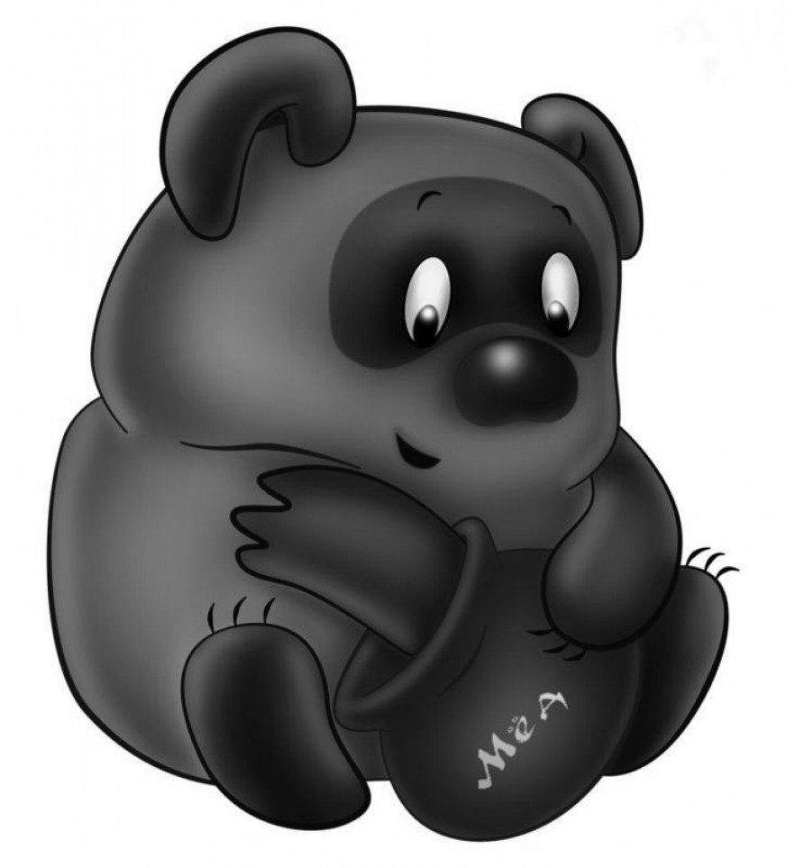
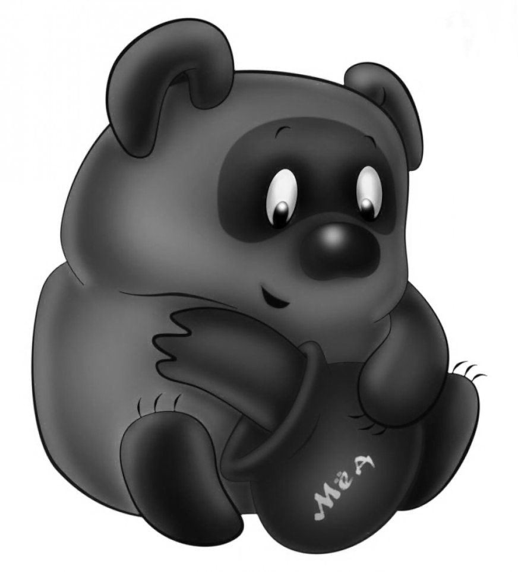
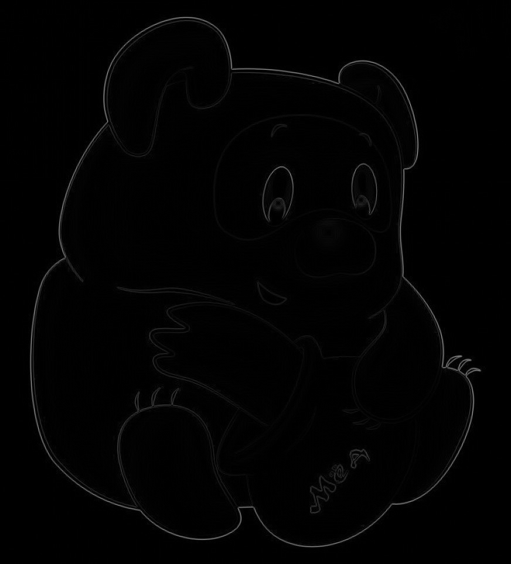
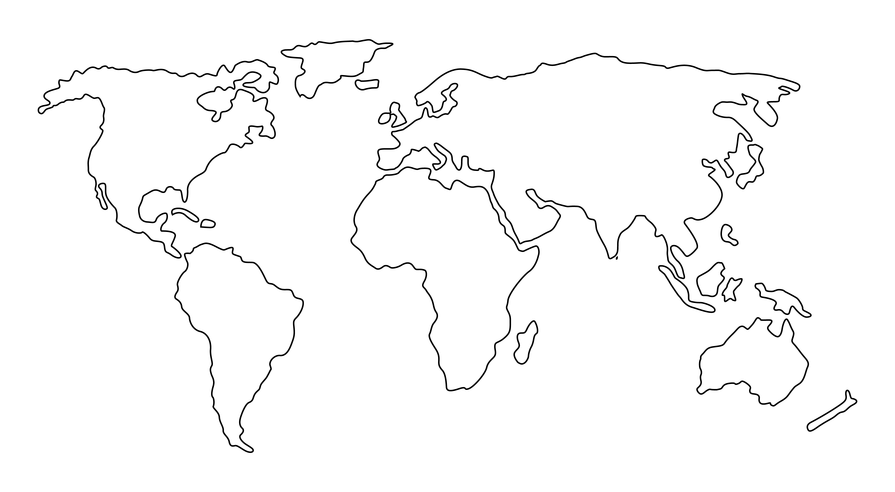
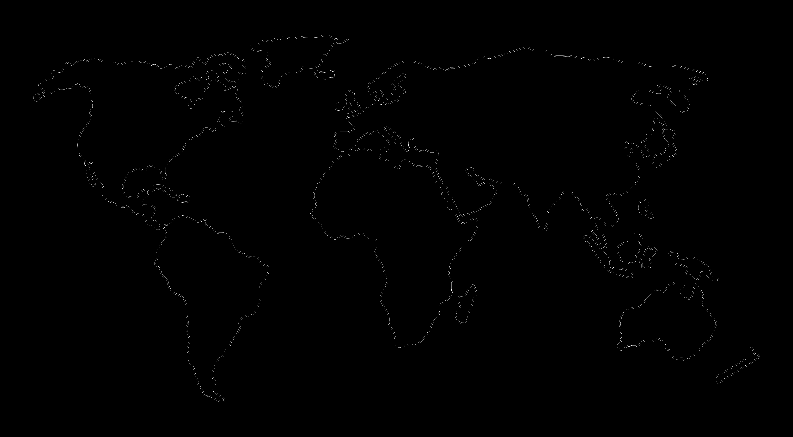

# Лабораторная работа №3

## Фильтрация изображений и морфологические операции

Вариант: `16`.

Метод: морфологическое расширение (дилатация).

Структурирующий элемент: диск `3 x 3`:

```text
0 1 0
1 1 1
0 1 0
```

## Результаты

### Изображение 1

Размер: `872 x 963`.

| Исходное | Дилатация | Разностное             |
| --- | --- |------------------------|
|  |  |  |

### Изображение 2

Размер: `7267 x 4000`.

| Исходное | Дилатация | Разностное             |
| --- | --- |------------------------|
|  |  |  |

## Вывод

В ходе работы для двух полутоновых входных изображений выполнено морфологическое расширение с дисковым структурирующим элементом `3 x 3`. В результате чёрные контуры объектов расширились на один пиксель по горизонтальному и вертикальному направлениям. Разностные изображения показывают пиксели, добавленные операцией дилатации.