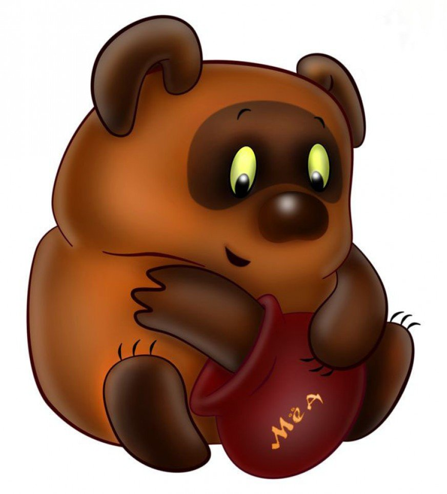
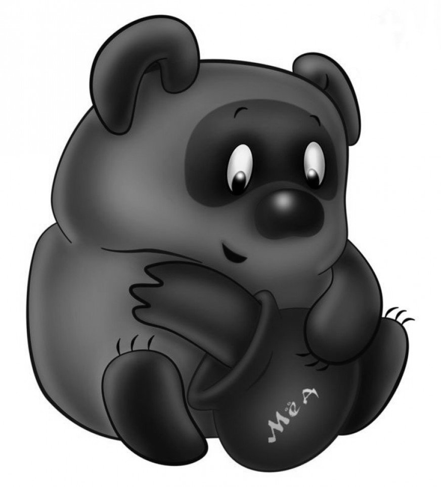
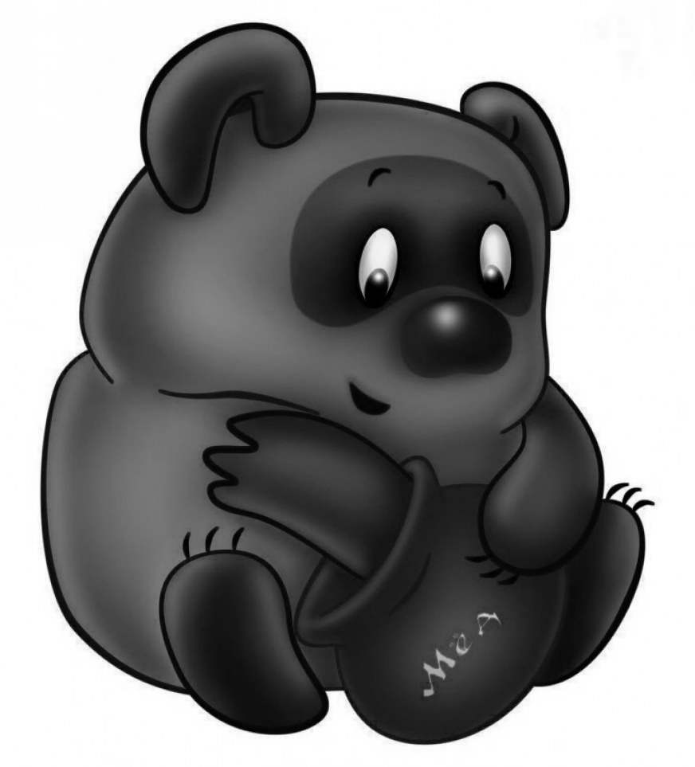
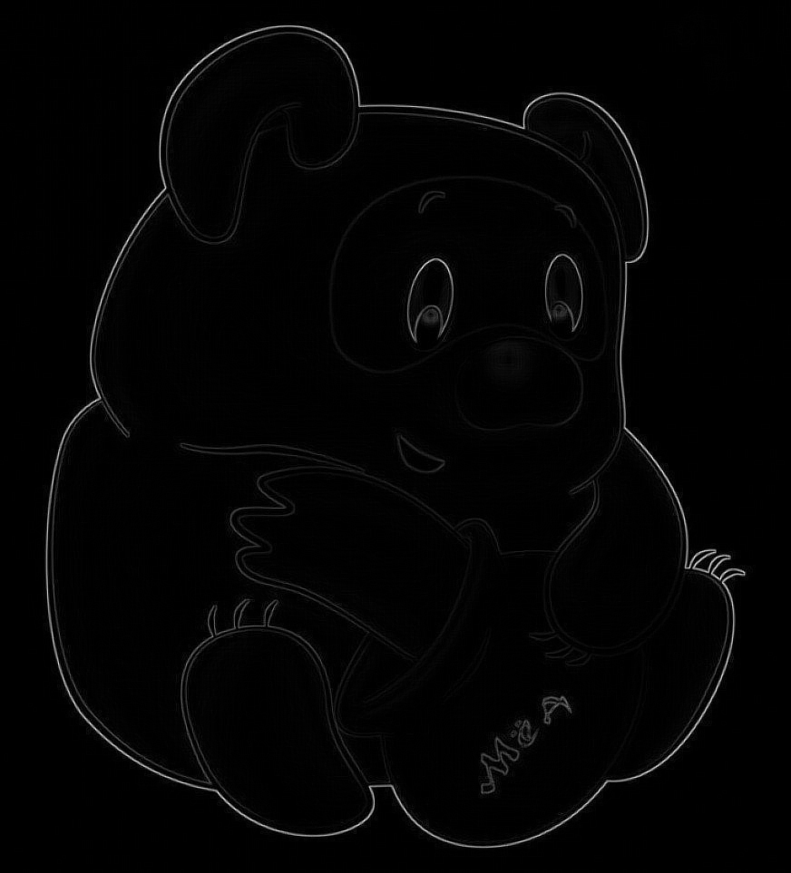
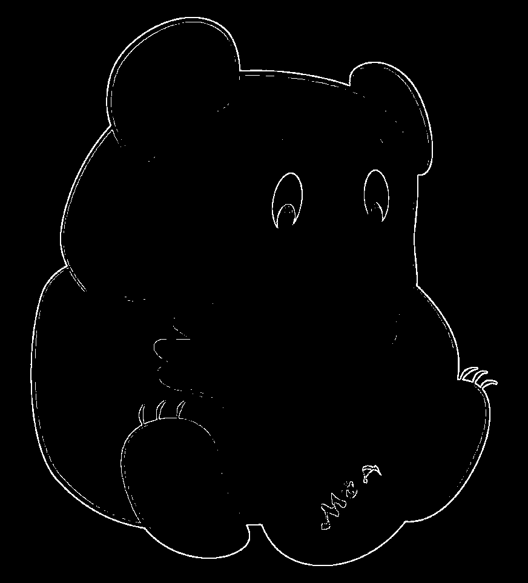

# Лабораторная работа №4

## Выделение контуров на изображении

Вариант: `16`.

Метод: разность исходного полутонового изображения и изображения после морфологического расширения черного объекта.

## Результаты

| Исходное изображение | Полутоновое изображение | Расширение черного |
| --- | --- | --- |
|  |  |  |

| Нормализованная матрица `G` | Бинаризованная матрица `G` |
| --- | --- |
|  |  |

## Вывод

В ходе работы выполнено выделение контуров методом морфологической разности для черного объекта. После расширения темных областей разность с исходным полутоновым изображением выделяет пиксели на границах объектов. Нормализация приводит матрицу `G` к диапазону яркости `0..255`, а бинаризация оставляет наиболее выраженные контуры.