# Лабораторная работа №5. Выделение признаков символов

## Вариант

Выполнен вариант `16`: казахские заглавные буквы.

Алфавит: `АӘБВГҒДЕЁЖЗИЙКҚЛМНҢОӨПРСТУҰҮФХҺЦЧШЩЪЫІЬЭЮЯ`

Параметры эталонов: шрифт Times New Roman, кегль 14

## Методика расчета признаков

Изображения бинаризованы порогом 128. Черный пиксель считается элементом символа.

- вес четверти: количество черных пикселей в соответствующей четверти изображения;
- удельный вес четверти: вес четверти, деленный на площадь четверти;
- центр тяжести: средние координаты черных пикселей;
- нормированный центр тяжести: координаты центра, деленные на максимальные индексы по ширине и высоте изображения;
- осевые моменты инерции: суммы квадратов расстояний черных пикселей до центра тяжести по горизонтальной и вертикальной осям;
- нормированные моменты: момент, деленный на произведение массы символа и квадрата соответствующего размера;
- профили X и Y: количество черных пикселей по столбцам и строкам.

## Эталонные изображения, профили и признаки

| Символ | Код | Эталон | Профиль X | Профиль Y |
|---|---:|---|---|---|
| А | `U+0410` |  | 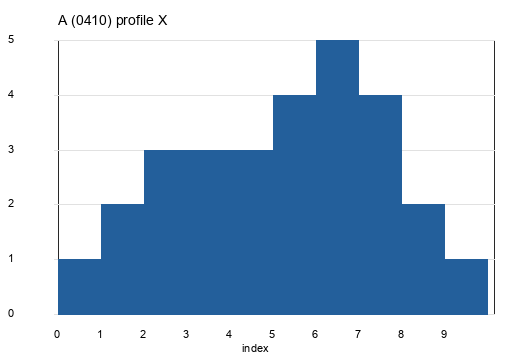 | 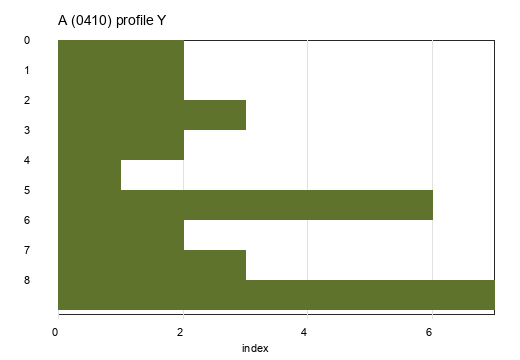 |
| Ә | `U+04D8` | 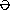 | 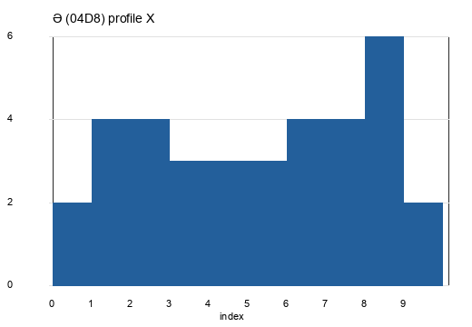 | 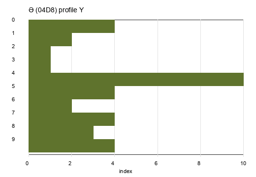 |
| Б | `U+0411` |  | 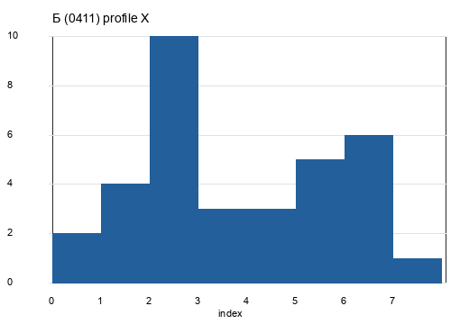 | 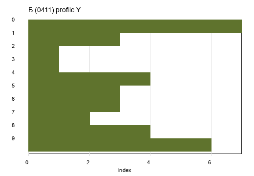 |
| В | `U+0412` |  | 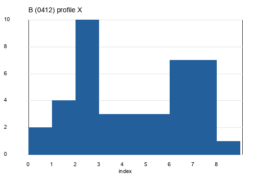 | 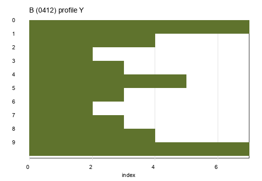 |
| Г | `U+0413` |  | 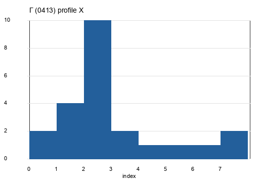 | 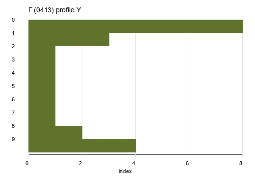 |
| Ғ | `U+0492` | 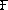 | 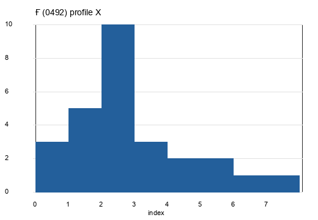 | 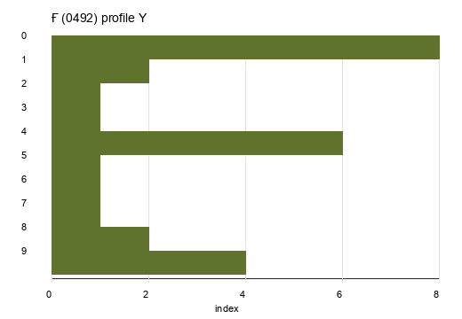 |
| Д | `U+0414` | 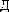 | 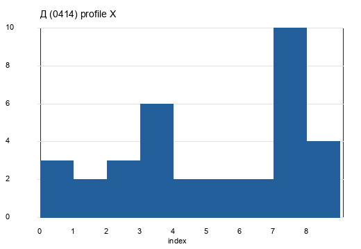 | 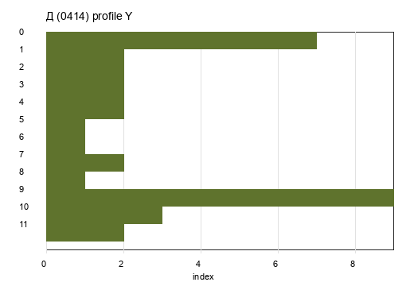 |
| Е | `U+0415` |  | 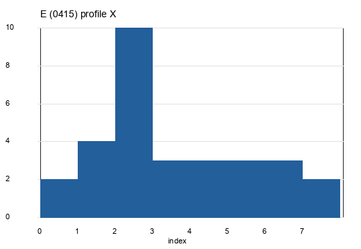 | 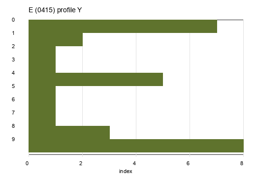 |
| Ё | `U+0401` | 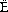 | 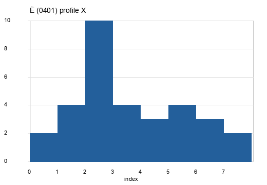 | 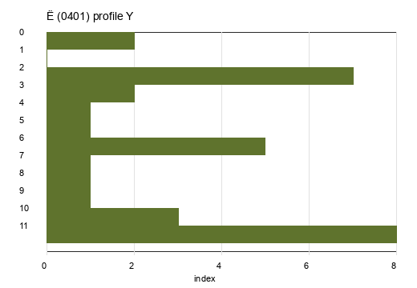 |
| Ж | `U+0416` | 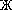 | 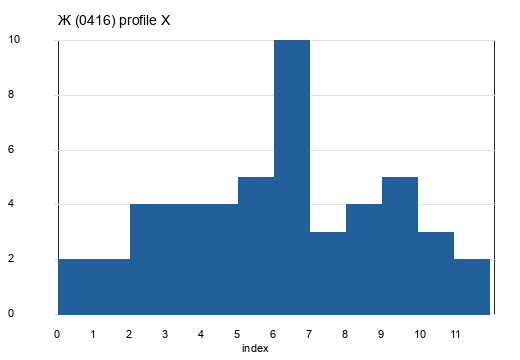 | 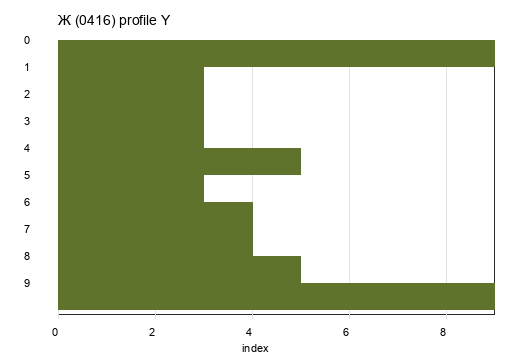 |
| З | `U+0417` | 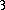 | 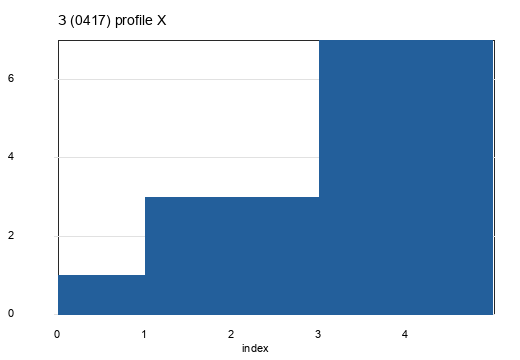 | 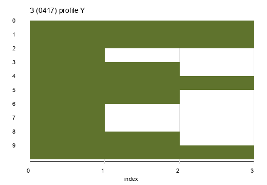 |
| И | `U+0418` |  |  | 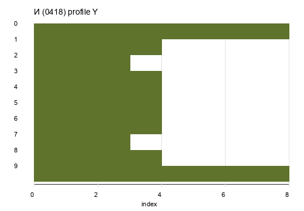 |
| Й | `U+0419` | 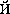 | 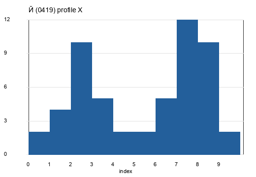 | 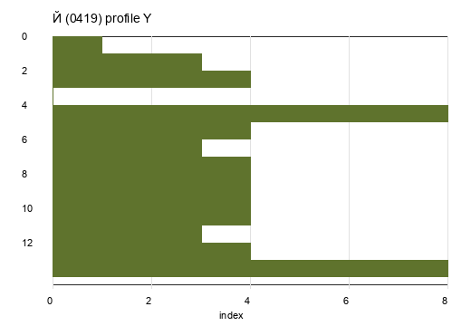 |
| К | `U+041A` | 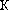 | 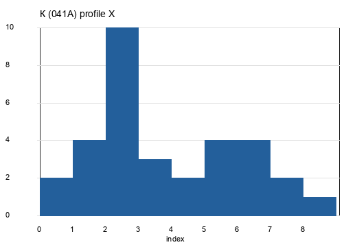 | 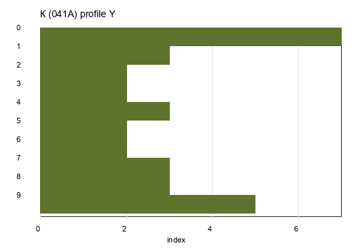 |
| Қ | `U+049A` | 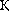 | 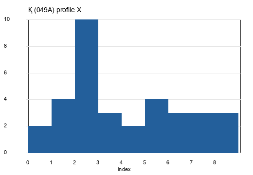 | 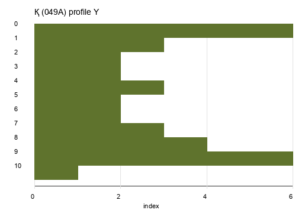 |
| Л | `U+041B` |  | 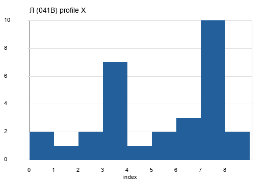 | 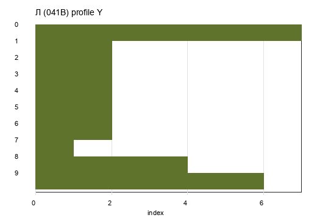 |
| М | `U+041C` |  | 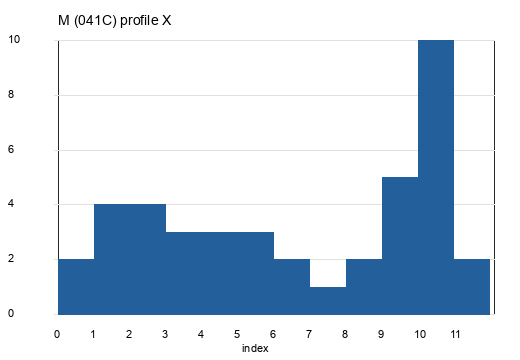 | 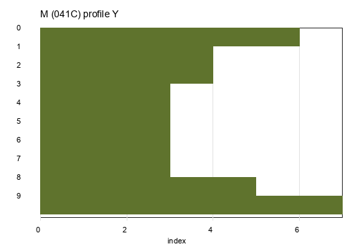 |
| Н | `U+041D` |  | 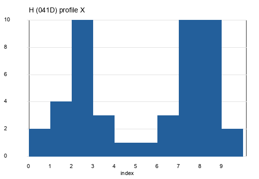 | 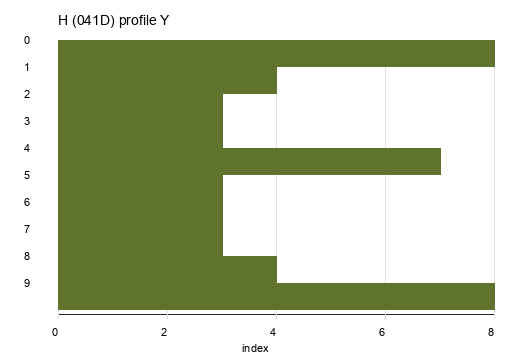 |
| Ң | `U+04A2` | 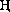 | 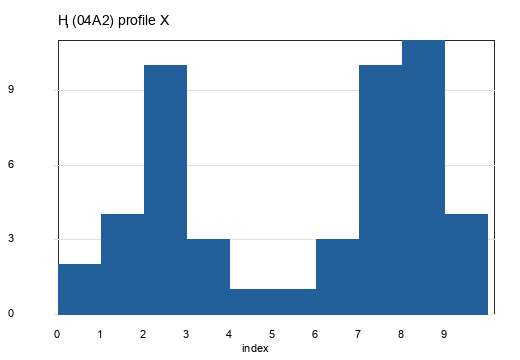 | 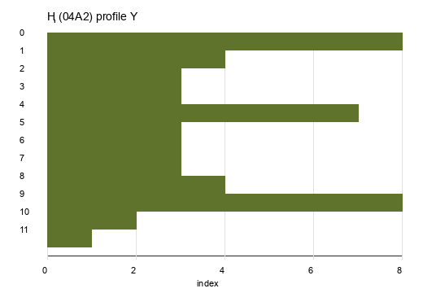 |
| О | `U+041E` |  | 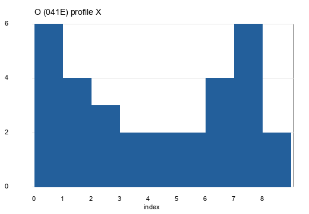 | 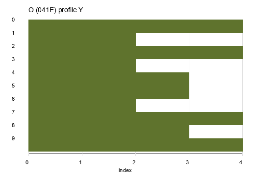 |
| Ө | `U+04E8` |  | 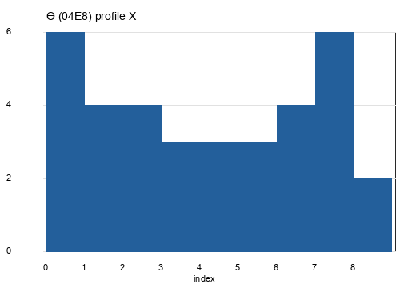 |  |
| П | `U+041F` |  |  |  |
| Р | `U+0420` |  |  |  |
| С | `U+0421` |  |  |  |
| Т | `U+0422` |  |  |  |
| У | `U+0423` |  |  |  |
| Ұ | `U+04B0` |  |  |  |
| Ү | `U+04AE` |  |  |  |
| Ф | `U+0424` |  |  |  |
| Х | `U+0425` |  |  |  |
| Һ | `U+04BA` |  |  |  |
| Ц | `U+0426` |  |  |  |
| Ч | `U+0427` |  |  |  |
| Ш | `U+0428` |  |  |  |
| Щ | `U+0429` |  |  |  |
| Ъ | `U+042A` |  |  |  |
| Ы | `U+042B` |  |  |  |
| І | `U+0406` |  |  |  |
| Ь | `U+042C` |  |  |  |
| Э | `U+042D` |  |  |  |
| Ю | `U+042E` |  |  |  |
| Я | `U+042F` |  |  |  |

Скалярные признаки сохранены в [`output/features.csv`](output/features.csv).

## Вывод

Для всех символов выбранного алфавита сформированы эталонные изображения, рассчитаны признаки распределения черных пикселей, сохранены профили X и Y. Полученные признаки позволяют сравнивать буквы по массе, положению центра тяжести и распределению пикселей по строкам и столбцам.
