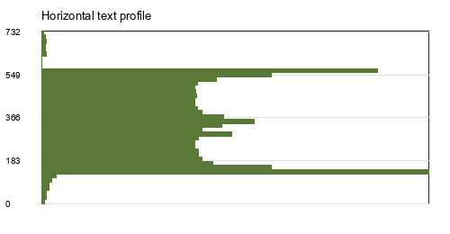
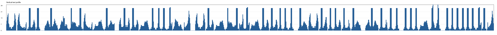

# Лабораторная работа №6. Сегментация текста

## Исходные данные

Фраза: 

Алфавит: кириллический алфавит с казахскими буквами, прописные и строчные буквы: `АӘБВГҒДЕЁЖЗИЙКҚЛМНҢОӨПРСТУҰҮФХҺЦЧШЩЪЫІЬЭЮЯаәбвгғдеёжзийкқлмнңоөпрстуұүфхһцчшщъыіьэюя`.

Шрифт: `Times New Roman`, кегль `14`.

## Алгоритм

1. PNG открывается как RGB-изображение на белом фоне.
2. Яркость пикселя рассчитывается по формуле `Y = 0.299R + 0.587G + 0.114B`.
3. Изображение бинаризуется порогом `160`: черные пиксели считаются элементами текста.
4. Белые поля обрезаются по минимальному прямоугольнику, содержащему текст, без дополнительного отступа.
5. Горизонтальный профиль содержит число черных пикселей в каждой строке, вертикальный профиль - число черных пикселей в каждом столбце.
6. Сегментация выполняется по вертикальному профилю: столбцы со значением `<= 1` считаются разрезами. Это дает прореживание тонких шумовых пикселей.
7. Для каждого найденного интервала уточняется вертикальная граница и сохраняется обрамляющий прямоугольник.

### Координаты сегментов

| № | x0 | y0 | x1 | y1 | ширина | высота |
| ---: | ---: | ---: | ---: | ---: | ---: | ---: |
| 1 | 0 | 9 | 24 | 34 | 24 | 25 |
| 2 | 27 | 9 | 49 | 34 | 22 | 25 |
| 3 | 51 | 9 | 71 | 34 | 20 | 25 |
| 4 | 72 | 9 | 82 | 34 | 10 | 25 |
| 5 | 93 | 9 | 125 | 34 | 32 | 25 |
| 6 | 128 | 9 | 151 | 34 | 23 | 25 |
| 7 | 154 | 9 | 186 | 34 | 32 | 25 |
| 8 | 187 | 9 | 209 | 34 | 22 | 25 |
| 9 | 213 | 9 | 236 | 34 | 23 | 25 |
| 10 | 239 | 9 | 263 | 41 | 24 | 32 |
| 11 | 274 | 9 | 300 | 34 | 26 | 25 |
| 12 | 302 | 9 | 321 | 34 | 19 | 25 |
| 13 | 325 | 9 | 347 | 34 | 22 | 25 |
| 14 | 350 | 9 | 361 | 34 | 11 | 25 |
| 15 | 365 | 9 | 376 | 34 | 11 | 25 |
| 16 | 377 | 9 | 388 | 34 | 11 | 25 |
| 17 | 392 | 9 | 403 | 41 | 11 | 32 |
| 18 | 405 | 9 | 428 | 34 | 23 | 25 |
| 19 | 431 | 9 | 447 | 34 | 16 | 25 |
| 20 | 459 | 9 | 483 | 34 | 24 | 25 |
| 21 | 485 | 9 | 504 | 34 | 19 | 25 |
| 22 | 508 | 9 | 530 | 34 | 22 | 25 |
| 23 | 533 | 9 | 565 | 34 | 32 | 25 |
| 24 | 566 | 9 | 591 | 41 | 25 | 32 |
| 25 | 593 | 9 | 616 | 34 | 23 | 25 |
| 26 | 619 | 9 | 638 | 34 | 19 | 25 |
| 27 | 640 | 9 | 659 | 34 | 19 | 25 |
| 28 | 660 | 9 | 671 | 34 | 11 | 25 |
| 29 | 672 | 9 | 683 | 34 | 11 | 25 |
| 30 | 687 | 9 | 698 | 34 | 11 | 25 |
| 31 | 709 | 9 | 732 | 34 | 23 | 25 |
| 32 | 734 | 9 | 758 | 34 | 24 | 25 |
| 33 | 760 | 9 | 780 | 34 | 20 | 25 |
| 34 | 782 | 9 | 793 | 34 | 11 | 25 |
| 35 | 794 | 9 | 813 | 34 | 19 | 25 |
| 36 | 815 | 9 | 836 | 34 | 21 | 25 |
| 37 | 838 | 9 | 861 | 34 | 23 | 25 |
| 38 | 872 | 9 | 904 | 34 | 32 | 25 |
| 39 | 906 | 9 | 926 | 34 | 20 | 25 |
| 40 | 928 | 9 | 939 | 34 | 11 | 25 |
| 41 | 943 | 9 | 954 | 34 | 11 | 25 |
| 42 | 965 | 9 | 975 | 34 | 10 | 25 |
| 43 | 978 | 9 | 987 | 34 | 9 | 25 |
| 44 | 991 | 9 | 1000 | 34 | 9 | 25 |
| 45 | 1004 | 9 | 1026 | 34 | 22 | 25 |
| 46 | 1029 | 0 | 1055 | 34 | 26 | 34 |
| 47 | 1066 | 9 | 1077 | 34 | 11 | 25 |
| 48 | 1078 | 9 | 1088 | 34 | 10 | 25 |
| 49 | 1092 | 9 | 1101 | 34 | 9 | 25 |
| 50 | 1104 | 9 | 1114 | 34 | 10 | 25 |
| 51 | 1116 | 9 | 1127 | 34 | 11 | 25 |
| 52 | 1128 | 9 | 1139 | 34 | 11 | 25 |
| 53 | 1143 | 9 | 1154 | 41 | 11 | 32 |
| 54 | 1155 | 9 | 1166 | 34 | 11 | 25 |
| 55 | 1168 | 9 | 1184 | 34 | 16 | 25 |

## Иллюстрации

### Бинарное изображение 

### Горизонтальный профиль

### Вертикальный профиль

### Сегментация

## Вывод

Для строки рассчитаны горизонтальный и вертикальный профили. По вертикальному профилю с пороговым прореживанием выделены обрамляющие прямоугольники символов, результаты сохранены в виде координат, вырезанных изображений и изображения с рамками.