# Лабораторная работа №8

## Текстурный анализ и контрастирование

Вариант: `16`.

Параметры варианта:

- матрица: `NGTDM`;
- расстояние окрестности: `d = 1`;
- признаки: `COS`, `CON`, `BUS`;
- преобразование яркости: линейное контрастирование.

## Результаты

## Изображение 1

Размер: `4597 x 7000`.

Диапазон яркости до контрастирования: `0..255`.

| Исходное | Полутоновое | Контрастированное полутоновое |
| --- | --- | --- |
| 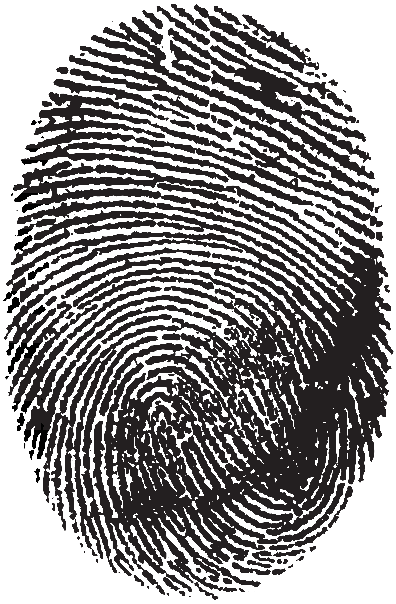 | 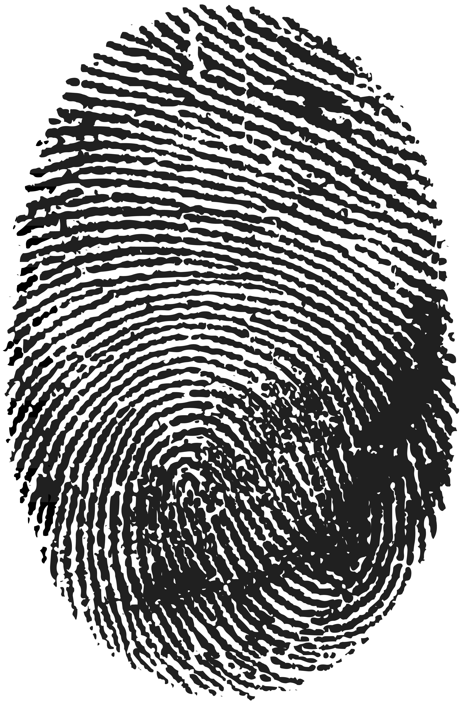 | 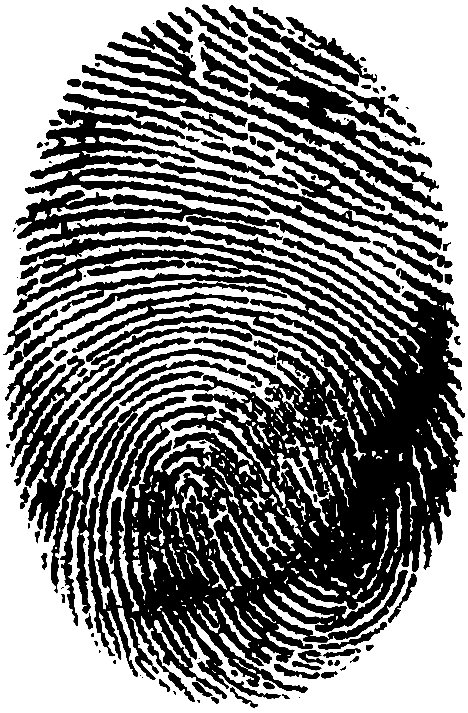 |

### Гистограммы яркости:

#### До 
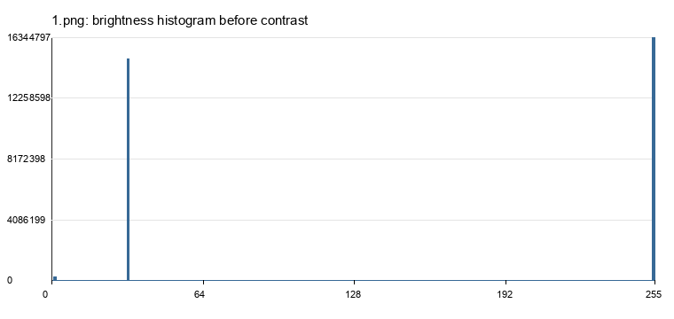

#### После
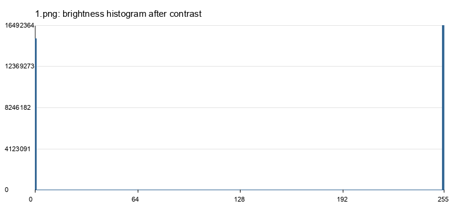 |

### NGTDM визуализирована столбчатой диаграммой:

#### До
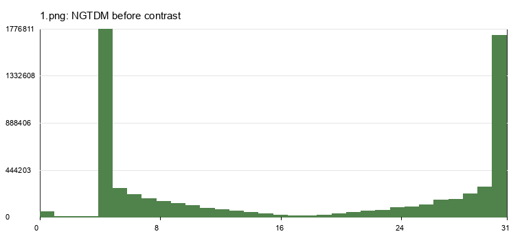 

#### После
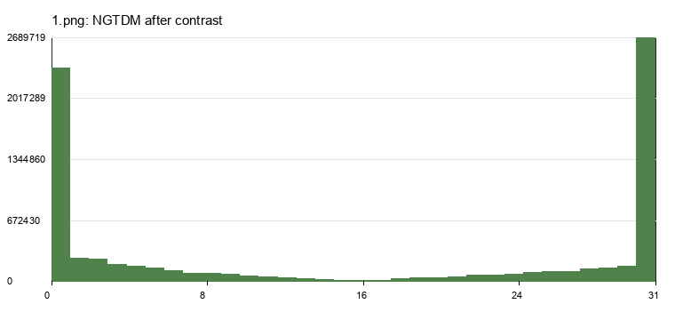

Текстурные признаки:

| Состояние | COS | CON | BUS |
| --- | --- | --- | --- |
| До контрастирования | 0.0000005868 | 0.0717422268 | 1560.8163909544 |
| После контрастирования | 0.0000004013 | 0.1160867654 | 2520.5790364573 |

CSV-файлы NGTDM:

- `output/1_ngtdm_before.csv`;
- `output/1_ngtdm_after.csv`.

## Изображение 2

Размер: `872 x 963`.

Диапазон яркости до контрастирования: `0..255`.

| Исходное | Полутоновое | Контрастированное полутоновое |
| --- | --- | --- |
| 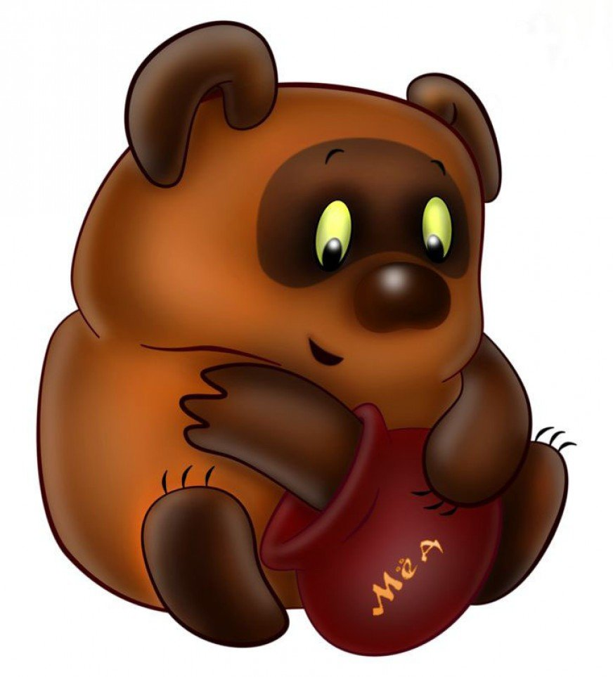 |  | 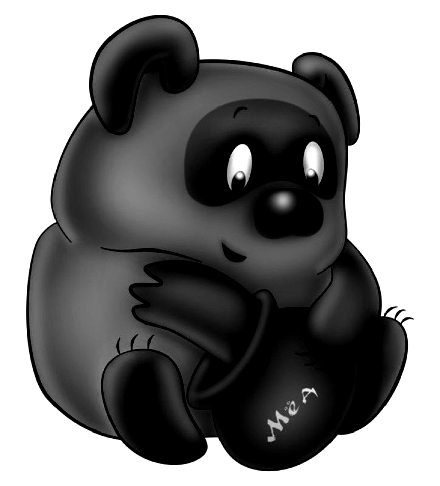 |

### Гистограммы яркости:

#### До 
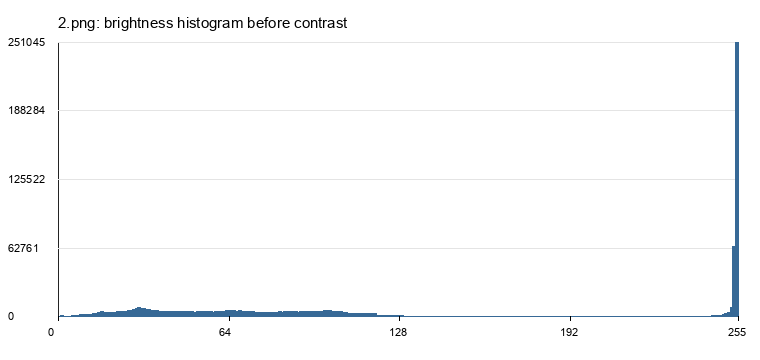

#### После
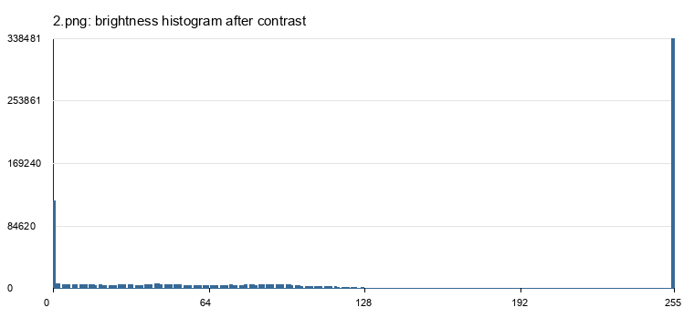

### NGTDM визуализирована столбчатой диаграммой:

#### До
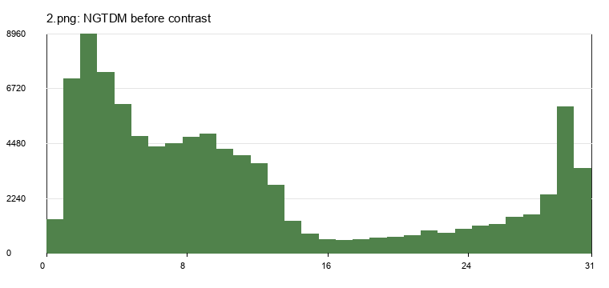 

#### После
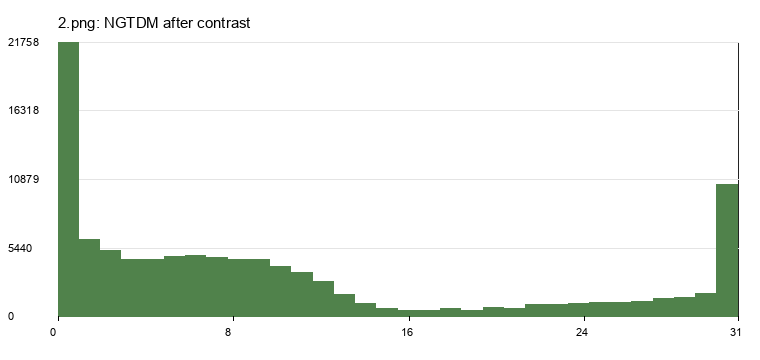

Текстурные признаки:

| Состояние | COS | CON | BUS |
| --- | --- | --- | --- |
| До контрастирования | 0.0002338875 | 0.0317279251 | 4.6747363382 |
| После контрастирования | 0.0001046926 | 0.0431983548 | 10.8316069868 |

CSV-файлы NGTDM:

- `output/2_ngtdm_before.csv`;
- `output/2_ngtdm_after.csv`.

## Вывод

После линейного контрастирования промежуточные уровни яркости отдаляются от середины шкалы, поэтому распределение уровней и значения NGTDM меняются. Признак `COS` характеризует грубость текстуры, `CON` - контраст, `BUS` - загруженность или резкость смены тонов. Сравнение значений до и после обработки показывает, как изменение яркостного диапазона влияет на текстурное описание изображений.
