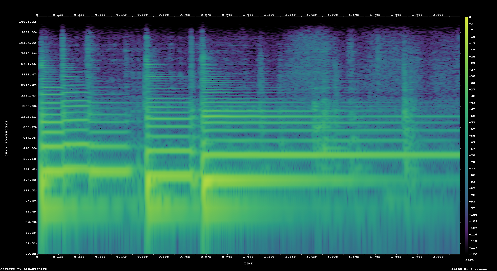
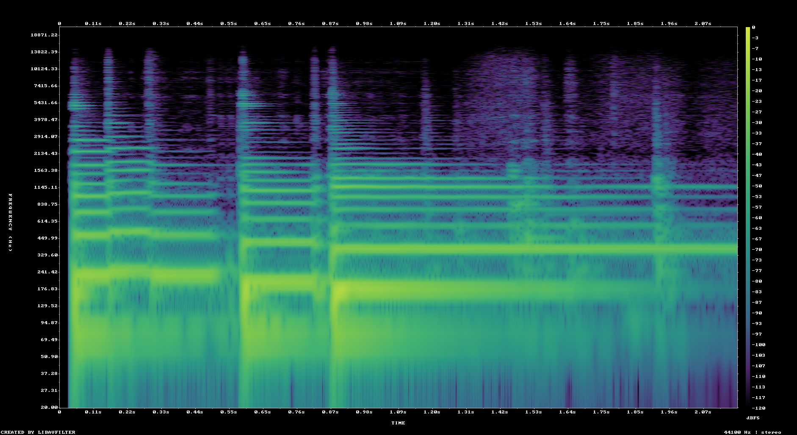

# Лабораторная работа 9. Анализ шума

## Исходные данные

- Файл: `1.wav`
- Длительность: `2.182` c
- Частота дискретизации: `44100` Гц
- Каналов в исходной дорожке: `2`
- Разрядность: `24` бит

Для численного анализа стереодорожка сведена к моно усреднением каналов.

## Спектрограммы

Спектрограммы построены утилитой `ffmpeg` фильтром `showspectrumpic` с окном Ханна (`win_func=hann`) и логарифмической шкалой частот (`fscale=log`).

#### До фильтрации: 

#### После фильтрации: 

## Оценка шума

Шум оценивался по самому тихому интервалу длиной 0.1 c. Это практичная оценка стационарного фонового шума для короткой записи.

- Самый тихий интервал начинается с `2.10` c
- RMS шума до фильтрации: `0.020431` (-33.79 dBFS)
- RMS всей записи до фильтрации: `0.102505` (-19.79 dBFS)
- Оценка SNR до фильтрации: `13.83` dB
- RMS шума после фильтрации: `0.021506` (-33.35 dBFS)
- RMS всей записи после фильтрации: `0.102245` (-19.81 dBFS)
- Оценка SNR после фильтрации: `13.35` dB

Подавление шума выполнено FFT-фильтром `afftdn`; восстановленная дорожка сохранена в `1_denoised.wav`.

## Максимумы энергии

Поиск выполнен с шагом `Δt = 0.1` c и полосой `Δf = 50` Гц в диапазоне до `5000` Гц. Полная таблица сохранена в `output\energy_maxima.csv`.

| # | t, c | f, Гц | энергия |
|---:|---:|---:|---:|
| 1 | 0.80-0.90 | 175-225 | 7.452562e+01 |
| 2 | 0.50-0.60 | 175-225 | 2.387279e+01 |
| 3 | 0.90-1.00 | 175-225 | 1.622433e+01 |
| 4 | 0.00-0.10 | 225-275 | 1.427875e+01 |
| 5 | 0.80-0.90 | 125-175 | 7.799733e+00 |
| 6 | 0.60-0.70 | 175-225 | 6.898904e+00 |
| 7 | 1.00-1.10 | 175-225 | 6.561724e+00 |
| 8 | 0.50-0.60 | 125-175 | 6.028276e+00 |
| 9 | 0.10-0.20 | 225-275 | 5.749395e+00 |
| 10 | 0.70-0.80 | 175-225 | 5.231775e+00 |
| 11 | 0.30-0.40 | 225-275 | 5.181070e+00 |
| 12 | 0.20-0.30 | 225-275 | 4.148209e+00 |
| 13 | 0.80-0.90 | 75-125 | 3.891774e+00 |
| 14 | 0.80-0.90 | 375-425 | 3.860328e+00 |
| 15 | 0.90-1.00 | 375-425 | 3.168869e+00 |
